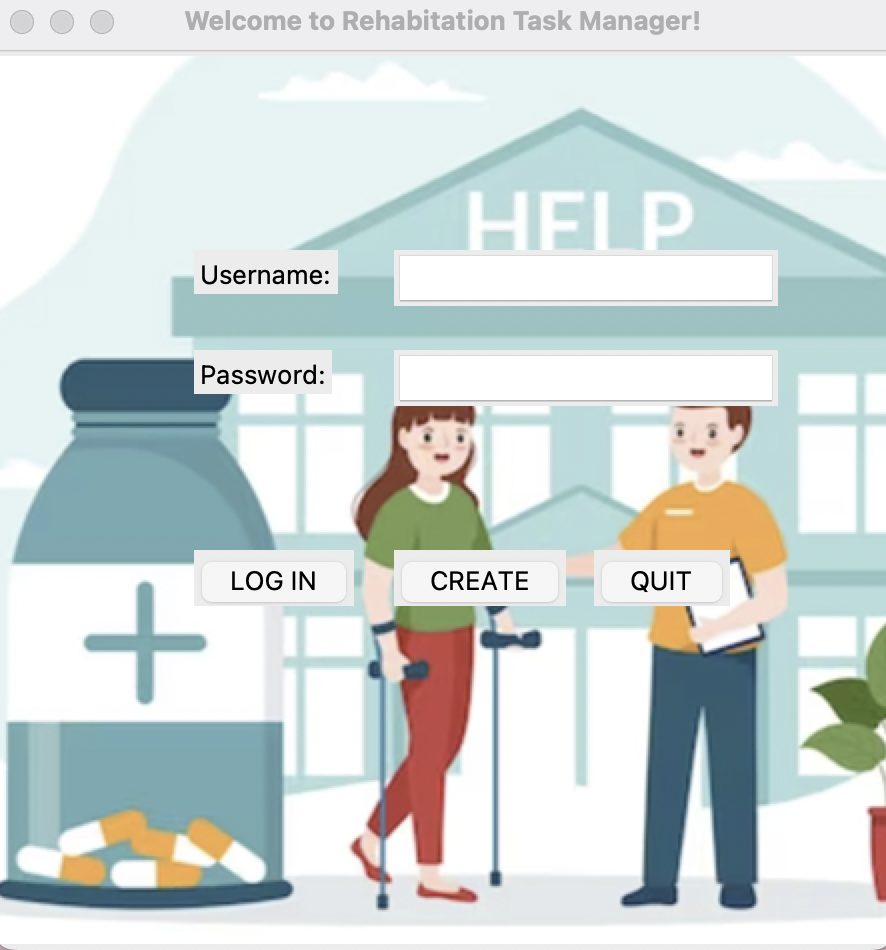

# Software-Carpentry-Final-Project (Rehabilitation Task Manager)

## Overview
Rehabilitation Task Manager is a Python-based desktop application designed to manage patient rehabilitation tasks. The application includes user-friendly graphical interfaces for logging in, managing patient information, and tracking tasks. It is suitable for use in rehabilitation centers, clinics, or by healthcare providers who need a simple and efficient way to manage patient data.

## Features

### Login Interface
- **Username and Password Authentication**:
  - Users can log in using their credentials.
  - Options to create a new account or exit the application.

### Main Menu
- After logging in, users are greeted with a personalized message and provided with the following options:
  - **Add Patient Information**: Add new patient records, including their details and rehabilitation progress.
  - **Delete Patient Information**: Remove patient records from the database.
  - **Edit Patient Information**: Modify existing patient details.
  - **Search Patient Information**: Search for specific patient records based on various criteria.
  - **Import Patient Information**: Import patient data from external files.
  - **Export Patient Information**: Export patient data to external files for backup or sharing.
  - **Task Management**: Manage specific tasks related to patients, such as assigning rehabilitation activities.
  - **Task Progress**: Track the progress of assigned tasks for individual patients.

